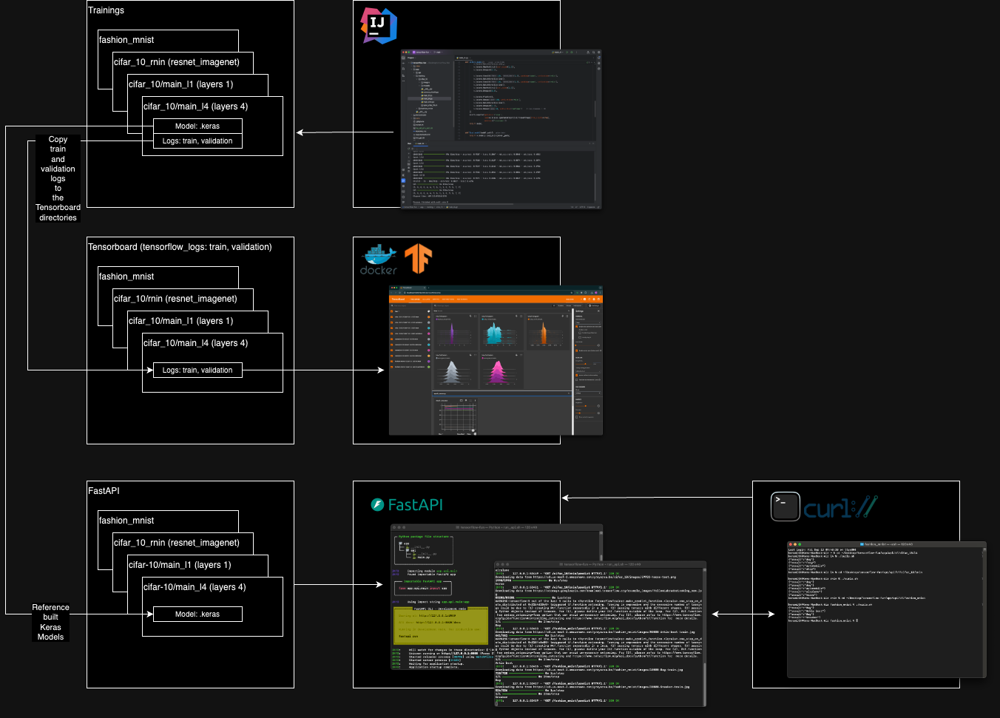

# tensorflow-fun

## References:
- https://www.tensorflow.org/tutorials
- https://www.tensorflow.org/guide
- https://www.tensorflow.org/tensorboard/get_started
- https://fastapi.tiangolo.com/

## Requirements:
Python 3.11: brew install python@3.11
-> /opt/homebrew/Cellar/python@3.11/3.11.9_1

## Purpose
Get a feel for Keras mostly. Train some models with some simple datasets, load the training and validation into Tensorboard and expose the models through FastAPI.

## Notes
The project could use much work as far as abstraction, orchestration, etc.
I used a bunch of shell scripts for various tasks. In general, the scripts are meant to be run from the directory they are in, change to that directory in your terminal before executing. Non-of these are required to run the different aspects of the application. Will an IDE and Docker Desktop you should be able to get all of this going.
* set_env_vars.sh - CAUTION: This copies ~/.zprofile to a timestamped back and modifies the original. Modify the variables in this to take easy advantage of some of the scripts. Restart your shell after running this. 
* venv_setup.sh - CAUTION: This deletes whatever folder is at ./venv and then creates a new virtual environment at ./venv.
* install.sh - Installs all of the requirements in the requirements.txt.
* run_api.sh - Starts the FastAPI server.
* curls.sh - The model directories under the api/tf directories have them, a set of curls to test the API.
* sync_*.sh - These will sync the images directories to an S3 location. (extract_*.py will save datasets locally)
* build.sh - Builds the Tensorboard Docker image.
* start.sh - Starts a Tensorboard Docker container.
* stop.sh - Stops and deletes the Tensorboard Docker container.
* test.sh - Starts a local Tensorboard server on port 6007.

## High Level Design/Flow
